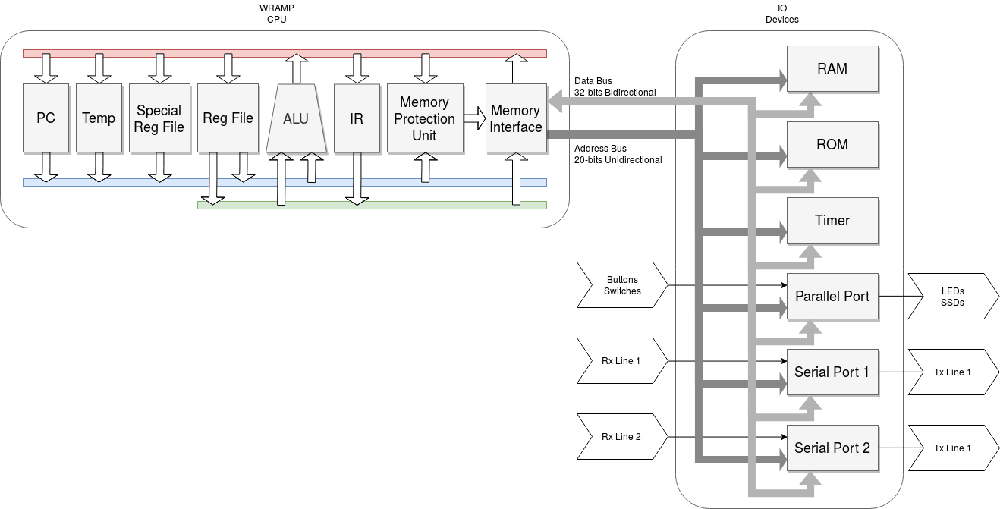

## Welcome to WRAMP

The Waikato RISC Architecture Micro Processor or WRAMP, is designed to be a simple architecture which can help you gain a practical understanding of the internal workings of a computer.
WRAMP provides an introduction to assembly programming, ABI conventions, interrupt handling and stack frames.
The initial implementation on REX boards was developed at the University of Waikato by Dean Armstrong, as part of an undergraduate degree. The implementation for [Basys3 FPGAs](https://reference.digilentinc.com/reference/programmable-logic/basys-3/start?redirect=1) was developed by Daniel Oosterwijk and Tyler Marriner at the University of Waikato.

The original version of WRAMP was written in VHDL across several logic devices within a host board, the REX board.
As part of the porting process, the source was rewritten in Verilog for use with Vivado and the Basys3.

The Verilog implementation is called WRAMPsys, please note this is not System Verilog despite the name. 

The WRAMP processor is bus based, with three internal buses.
IO devices are memory mapped which include 2 serial ports, a parallel port, a timer module and the ROM/RAM modules.

WRAMPmon is a monitor built into the source of WRAMPsys via a .mem file, monitor.mem is provided with the WRAMPsys repo, and can also be rebuilt from WRAMPmon.
WRAMPmon allows the loading of .srec files to RAM via a serial connection, as well as debugging loaded software.
Producing .srec files is explained in the [manual](/assets/book.pdf).

The serial ports themselves can be accessed by your favorite program, remote (//TODO link to remote) is provided as it has useful tools for uploading files to WRAMPmon.
Serial ports default to 38400baud, 1 stop bit and no parity upon reset.
Slower speeds can be choosen if desired.

A simulator is provided to bypass the need for the actual hardware.
The simulator provides the ability to view the contents of RAM and the registers as software is running as well as stepping through the code.

wasm, and wcc make up the toolchain for WRAMP.
wasm, contains the assembler, linker and object viewer (wasm, wlink, wobj).
wcc is a compiler based off of lcc.

Also included are syntax highlighters for geddit, vim and vscode (vscode has a WRAMP extension you can find in the market place).

